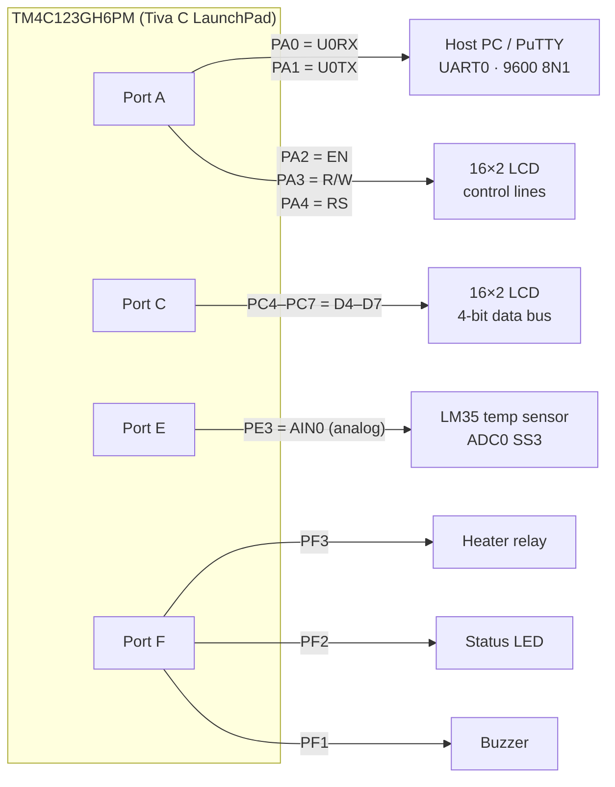
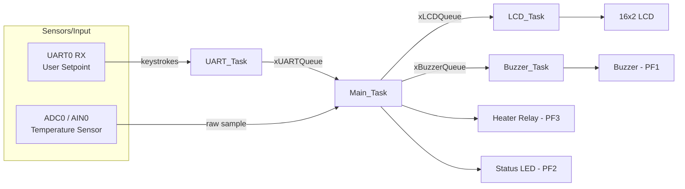

# Temp On/Off Controller — FreeRTOS Embedded Temperature Control System

A real-time, multitasking ON/OFF temperature controller built on the **TI Tiva C TM4C123GH6PM** (ARM Cortex-M4) LaunchPad, running **FreeRTOS**. The system reads a temperature sensor over ADC, drives a heater relay with hysteresis control, lets a user change the setpoint live over a serial terminal, mirrors live readings on a 16x2 character LCD, and raises an audible alarm on over-temperature — with all of it coordinated across four concurrent RTOS tasks communicating exclusively through queues (no shared globals, no polling flags between tasks).

Originally built as an academic Real-Time and Embedded Systems course project, then modernized: rebuilt against a current Keil/CMSIS-FreeRTOS toolchain, peripheral access unified onto a single HAL, and several latent bugs fixed (see below).

## Why this project is interesting

It's a small system, but it exercises the core skills of real-time embedded development end to end:
- Multitasking with FreeRTOS (task creation, priorities, time-slicing)
- Inter-task communication via queues instead of shared state
- Peripheral bring-up (GPIO, UART, ADC) on the TM4C123
- A hand-rolled 4-bit nibble-mode HD44780 LCD driver
- A closed-loop control decision (hysteresis band around a user-adjustable setpoint) driven by live sensor data
- A serial CLI (over PuTTY) as the human interface for changing control parameters at runtime

## System overview

| | |
|---|---|
| **MCU** | TI TM4C123GH6PM, ARM Cortex-M4F, 12 MHz crystal, 256 KB flash / 32 KB RAM |
| **RTOS** | FreeRTOS (CMSIS-RTOS build), 1 kHz tick, preemptive + time-sliced |
| **Sensor input** | Analog temperature sensor (e.g. LM35) on ADC0 channel AIN0 (PE3) |
| **Actuators** | Heater relay (PF3), status LED (PF2), buzzer (PF1) |
| **HMI** | 16x2 character LCD (4-bit nibble mode) + serial terminal over UART0 @ 9600 baud (PA0/PA1) |
| **Toolchain** | Keil MDK-ARM / uVision5, TI TivaWare `driverlib` 2.2.0.295 |

### Inputs / Outputs

**Inputs**
- Analog temperature reading (potentiometer/LM35 stand-in) via ADC0
- User-entered setpoint temperature via UART terminal (PuTTY)

**Outputs**
- Heater relay
- Status LED (mirrors heater state)
- Buzzer (over-temperature alarm)
- 16x2 LCD showing measured vs. setpoint temperature

## Pinout

All peripherals sit on distinct pins — there are no pin conflicts. LCD control shares Port A with the UART but uses different pins (PA2–PA4 vs PA0–PA1), and the LCD data bus uses PC4–PC7, deliberately avoiding PC0–PC3 (the TM4C123's JTAG/SWD debug pins).



| MCU pin | Signal | Connected to | Dir |
|---|---|---|---|
| PA0 | U0RX | Host PC (USB virtual COM via on-board ICDI) | in |
| PA1 | U0TX | Host PC (USB virtual COM via on-board ICDI) | out |
| PA2 | EN | LCD Enable | out |
| PA3 | R/W | LCD Read/Write (held low → write-only) | out |
| PA4 | RS | LCD Register Select | out |
| PC4 | D4 | LCD data bus (4-bit mode) | out |
| PC5 | D5 | LCD data bus | out |
| PC6 | D6 | LCD data bus | out |
| PC7 | D7 | LCD data bus | out |
| PE3 | AIN0 | LM35 temperature sensor (analog in) | in |
| PF1 | GPIO | Buzzer | out |
| PF2 | GPIO | Status LED | out |
| PF3 | GPIO | Heater relay | out |
| PE0–PE2, PE4–PE5 | GPIO | configured as outputs, currently unused | out |

Notes:
- Only 4 of the LCD's 8 data lines are wired (4-bit nibble mode); LCD `D0`–`D3` are unused, which halves the GPIO pin count.
- `PF1`–`PF3` are also the LaunchPad's on-board RGB LED (red/blue/green), so the heater/LED/buzzer states are mirrored on the on-board LED.
- The LCD's contrast pin (`V0`, pin 3) and backlight are supplied externally (e.g. a trim potentiometer), not by the MCU.

## Architecture

Four FreeRTOS tasks, all created at equal priority and scheduled with 1 ms time-slicing, communicate through three single-slot queues (each queue holds exactly one item, so every task always acts on the freshest value rather than a growing backlog):



### Task responsibilities

| Task | Priority | Behavior |
|---|---|---|
| **Main_Task** | 7 | Samples ADC0 (LM35 on PE3), converts to °C, compares against the current setpoint with a hysteresis band, drives the heater relay + LED, forwards display text to the LCD task, and raises/clears the buzzer flag when the reading crosses `AlarmValue` (70°C). |
| **UART_Task** | 7 | Prints a prompt over UART0, blocking-reads digits typed by the user until Enter, accumulates them into a new setpoint, and publishes it to `Main_Task`. |
| **LCD_Task** | 7 | Initializes the LCD once, then redraws "Measured" / "Setpoint" once per second from the latest values pushed by `Main_Task`. |
| **Buzzer_Task** | 7 | Toggles the buzzer GPIO based on the alarm flag from `Main_Task`. |

### Control logic

`Main_Task` implements a heater ON/OFF controller with a hysteresis band rather than a simple threshold, to avoid relay chatter right at the setpoint:

- Temperature > setpoint + 2°C → heater/LED **OFF**
- Temperature < setpoint − 1°C → heater/LED **ON**
- Inside the band → holds the previous state
- Temperature > 70°C (fixed alarm threshold) → buzzer **ON**

## Files and custom drivers

| File | Role |
|---|---|
| [`Trial2.c`](Trial2.c) / [`Trial2.h`](Trial2.h) | Application core: hardware bring-up (`PROJECT_Init`, `PORTE_init`, `PORTF_init`, `UART_Init`, `ADC_Init`), all four RTOS tasks, and a small hand-written `itoa`/`reverse`/`swap` for formatting temperatures onto the LCD without pulling in a full C library `itoa`. Peripheral access here is currently a mix of raw register macros and CMSIS-style structs (see Known issues). |
| [`Main0.c`](Main0.c) | Entry point — `main()` creates the four tasks and starts the FreeRTOS scheduler. |
| [`LCD.c`](LCD.c) / [`LCD.h`](LCD.h) | Custom HD44780-compatible LCD driver written against TI's TivaWare `driverlib`. Supports 4-bit nibble-mode communication (halving the GPIO pin count needed vs. 8-bit mode), cursor/position tracking across both lines, and byte/string/number output primitives (`LCD_sendByte`, `LCD_sendString`, `LCD_sendNum`). |
| [`tm4c123gh6pm.h`](tm4c123gh6pm.h) | Vendor register-definition header for the TM4C123GH6PM (memory-mapped peripheral registers), used for direct register-level GPIO/UART access in `Trial2.c`. |
| [`RTE/RTOS/FreeRTOSConfig.h`](RTE/RTOS/FreeRTOSConfig.h) | FreeRTOS kernel configuration — 1 kHz tick, preemption + time-slicing enabled, 8 KB heap, `heap_1` allocator. |
| [`Lab3.uvprojx`](Lab3.uvprojx) | Keil uVision5 project definition (device, memory map, TivaWare include paths, source file list). |
| `Trial.c` | Early standalone LCD test program with its own `main()`, excluded from the Keil build (not listed in `Lab3.uvprojx`). |

## Building

Requires:
- Keil MDK-ARM / uVision5 with the TI TM4C123GH6PM device pack
- [TivaWare_C_Series 2.2.0.295](https://www.ti.com/tool/SW-TM4C) installed at `C:\ti\TivaWare_C_Series-2.2.0.295` (hardcoded in the project's include paths)

Steps:
1. Open `Lab3.uvprojx` in uVision5.
2. Build (F7).
3. Flash to the LaunchPad over its onboard debugger (F8).
4. Open a serial terminal (e.g. PuTTY) at 9600-8-N-1 on the LaunchPad's virtual COM port to interact with `UART_Task`.

Command-line (batch) build is also available via Keil's `UV4.exe`, e.g.:
```
UV4.exe -r "Lab3.uvprojx" -j0 -o "build.log"
```
(`-r` rebuilds all files; `-j0` runs non-interactively.)

## Fixes applied

- **Modernized the deprecated FreeRTOS queue type.** The code used the legacy `xQueueHandle` alias, which the currently installed CMSIS-FreeRTOS 11.3.0 pack no longer defines (compile error: `unknown type name 'xQueueHandle'`). Changed to the current `QueueHandle_t` in `Trial2.c`.
- **Disabled unused software-timer support.** `RTE/RTOS/FreeRTOSConfig.h` had `configUSE_TIMERS` set to `1`, but the app doesn't use FreeRTOS software timers and `timers.c` isn't part of the build — this produced linker errors (`xTimerCreateTimerTask`, `xTimerGetTimerDaemonTaskHandle` undefined). Set `configUSE_TIMERS` to `0` to match what's actually used.
- **Added the required stack-overflow hook.** `configCHECK_FOR_STACK_OVERFLOW` is set to `2`, which requires the application to supply `vApplicationStackOverflowHook` — it was missing, causing a link error. Implemented it in `Main0.c` (traps with interrupts disabled so the offending task can be inspected in the debugger, rather than silently disabling the check).
- **Removed an unused duplicate config file.** A root-level `FreeRTOSConfig.h` existed alongside the actual active config at `RTE/RTOS/FreeRTOSConfig.h`; the root copy wasn't referenced anywhere in `Lab3.uvprojx` and was deleted.
- **Initialized the `setpoint` variable.** In `Main_Task`, `unsigned char setpoint` was previously uninitialized and only ever written by a non-blocking queue read — before the user's first UART entry, the heater/LED logic ran against whatever garbage happened to be on the stack. Now defaults to `25`.
- **Fixed an operator-precedence bug in the temperature conversion.** `Temperature=(int) mV/10.0;` cast `mV` to `int` *before* dividing (the cast binds tighter than `/`), truncating a step earlier than intended. Changed to `Temperature=(int)(mV/10.0);`.

## Known issues / not yet fixed

These are tracked but not yet addressed:

1. **Unify the peripheral-access style.** The same GPIO/ADC/UART peripherals are touched through different idioms depending on the file: raw register macros from `tm4c123gh6pm.h` and CMSIS-style peripheral structs in `Trial2.c`, versus TivaWare `driverlib` calls throughout `LCD.c`. Standardizing on one (ideally `driverlib`) would remove a whole class of "which style am I supposed to use here" friction, and would also let magic-number pin masks (`0x37`, `0x0e`, `0x08`, `0x04`, `0x02`) be replaced with named constants.
2. **LCD peripheral-clock race.** `LCD_setup()` enables the Port A/C clocks and configures their pins on the very next line, with no wait for the clock to stabilize — a known TM4C123 gotcha.
3. **Dead/duplicate entry points and stale names.** `Trial.c` is an unused standalone LCD test; `Main0.c` (the real entry point) and `Trial2.c`/`Trial2.h` (the application core) carry legacy names from earlier demo iterations, and the Keil project itself is still named `Lab3`.
4. **Monolithic application file.** `Trial2.c` holds ADC/UART/GPIO init *and* all four RTOS tasks in one file.
5. **Avoid busy-waiting inside RTOS tasks.** `Main_Task` and `Buzzer_Task` never call `vTaskDelay`, and every queue read uses a `0` (non-blocking) timeout. This only works because `configUSE_TIME_SLICING` is enabled — each task still burns its full time slice spinning rather than yielding.
6. **Guard the LCD text buffers.** `Message.Txt1`/`Txt2` are fixed 4-byte arrays fed by `itoa`; a 3-digit temperature plus the null terminator exactly fills the buffer with zero margin for a sign character or a 4th digit.
7. **Validate UART input.** `UART_Task` accumulates every received byte as `N - '0'` with no check that the character was actually a digit, and no bound on the number of digits entered before Enter.
